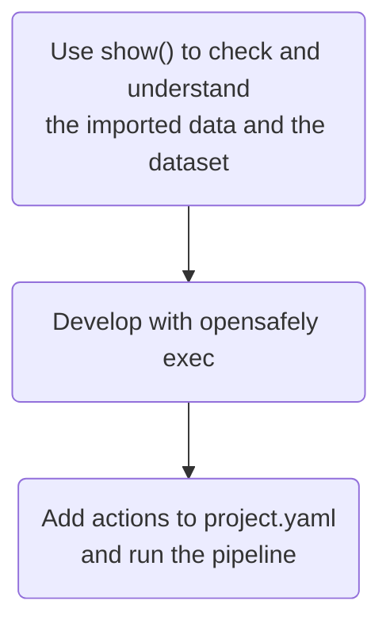

# Instructor guide

Notes from running the ehrQL demo a few times, with different participants and different formats. Use whatever fits your session.

## Choosing a format for the workshop

What works best depends on the participants' experience and on how you like to run the session.

### Fully interactive

Everyone has a codespace open, and you build a dataset definition together, line by line, using `show()`, then run it with `opensafely exec`, then walk through `project.yaml`. Works well in 60 to 90 minutes with a small group. Doesn't leave much time beyond the basics but gives everyone good experience what it feels like to work with ehrQL and hopefully leaves no one behind.

### Short demo, then a full solution, then tasks

Start with a very short interactive bit, writing a few lines of ehrQL live so participants see the basics. Then walk through a complete solution dataset or measures definition, explaining each step and feature as you go, and pointing out other ways to reach the same result. Then hand over to a practical bit, for example the [tasks](README.md#completing-the-tasks) in the README.

Covers more ground because you're not waiting for everyone to type along with you. Works well with a larger group or more than one instructor.

### Demonstration only

You build the dataset definition interactively, taking suggestions from participants, but only you have Codespaces open. No setup and no laptops needed. Good for short sessions, 20 to 30 minutes, or a group with no coding background.

## Before you start

Check the experience of participants with these before you start, it may change how much you need to explain:

- **GitHub and the terminal**: participants can usually follow the ehrQL logic fine even if they're unsure of the terminal, so you probably don't need to spend much time here.
- **Analysis pipelines**: most participants may not have worked with a `project.yaml` file before. Give it a bit more time if pipelines are new to everyone, or just show that it exists and move on.
- **Dummy data**: worth explaining early that `show()` uses dummy data and never touches real patient data. ehrQL also supports more advanced ways to shape dummy data, but that's probably more than a first workshop needs, even though it may be one of the first questions from academic participants.

## Practical tips

- Check what came before this session, for example whether participants already know OpenSAFELY, OpenCodelists, SNOMED CT, or dm+d. You may need to cover some of this first.
- Set up codespaces and clone the repo the day before if you can.
- Run `opensafely run run_all` once before the session, so the Docker images are already pulled.

## Local development workflow

Here is a good example workflow when writing ehrQL. Each box is a different way of running ehrQL. The first two boxes give you quick feedback, and the last boxes is close to how it runs on the server.

